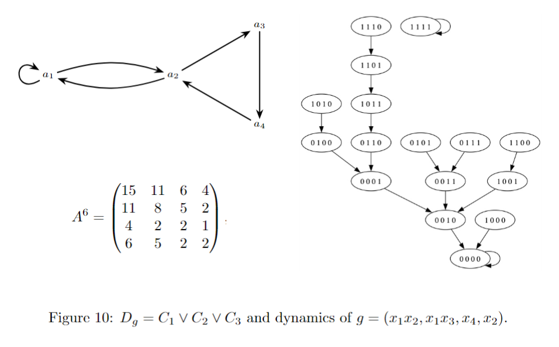

  <a class="nav-button" href="#about">About</a>
  <a class="nav-button" href="#snapshot">Research Snapshot</a>
  <a class="nav-button" href="#interests">Research Interests</a>
  <a class="nav-button" href="#publications">Publications</a>
  <a class="nav-button" href="#teaching">Teaching</a>
  <a class="nav-button" href="#contact">Contact</a>

## About

I am a mathematician working in discrete dynamical systems, Boolean functions, exponential sums, and algebraic combinatorics. My research focuses on structural and computational questions related to monomial dynamical systems and k-rotation symmetric Boolean functions.

## Research Snapshot

<figure class="research-figure">
  
  <figcaption>State-space diagram associated with a Boolean monomial dynamical system.</figcaption>
</figure>

## Research Interests

- Discrete dynamical systems
- Boolean functions and Walsh transforms
- Exponential sums and nonlinearity
- Algebraic combinatorics
- Mathematical analysis

## Selected Publications

### On the composition operator with variable integrability
*AIMS Mathematics* **10**(2) (2025), 2021–2041.  
With Carlos F. Álvarez, Javier Henríquez-Amador, and Jhon Millán G.

### On the Transient of Boolean Monomial Dynamical Systems
Submitted.  
With Omar Colón-Reyes, Mario J. Motiño Palma, and Arnaldo Vera.
##  Closed formulas for exponential sums of cubic k-rotation symmetric Boolean functions
Submitted.
Jos\'e E. Calder\'on-G\'omez, Rodrigo A. Le\'on-Prato, Luis A. Medina

### Current Projects

- The weight and nonlinearity of quartic k-rotation symmetric Boolean functions
- Recursive exponential sums for k-rotation symmetric Boolean functions
- A Control Theory for Monomial Dynamical Systems over Finite Fields

## Teaching

I have served as instructor and teaching assistant in Basic Mathematics, Precalculus I and II, and Calculus I, II, and III, as well as in bridge, immersion, and mathematical enrichment programs.

## Contact

For research collaborations, talks, or teaching opportunities, please use the links in the left sidebar.
